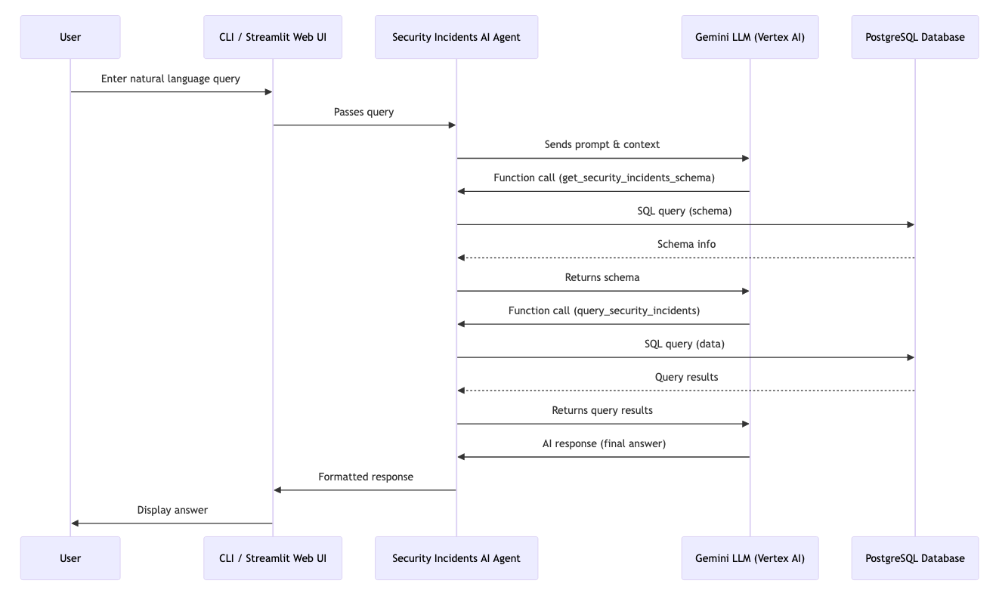
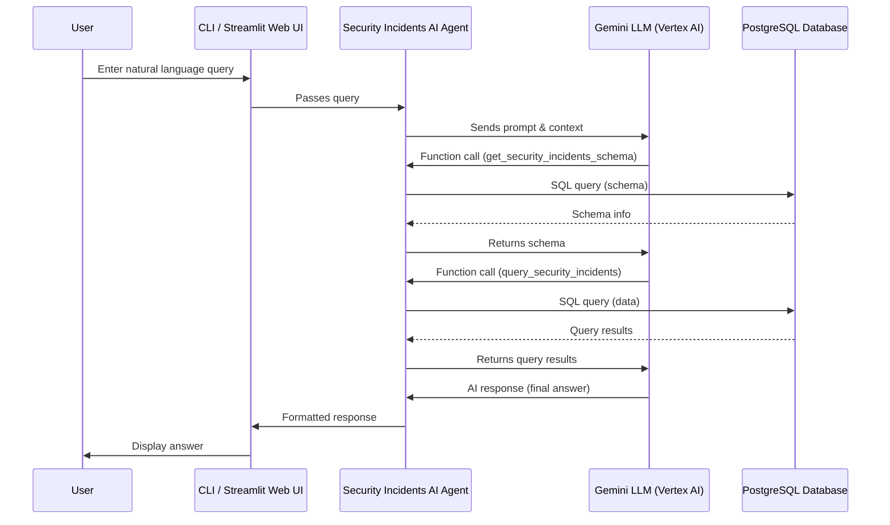

# Security Incidents AI Query Agent

An AI agent that enables security analysts to query a PostgreSQL database of security incidents using natural language. This solution leverages Google's Gemini API to translate natural language queries into SQL, execute them, and return formatted responses.

## Architecture Overview

This solution consists of the following components:

1. **AI Query Engine**: Uses Gemini API for natural language understanding and SQL generation
2. **Function Calling Interface**: Defines custom functions for Gemini to invoke for database operations
3. **Database Connector**: Handles communication with the PostgreSQL database
4. **Response Formatter**: Formats the query results into human-readable responses

---

### Sequence Diagram





---

## Features

- **Natural Language Understanding**: Understand complex security-related queries in plain English
- **SQL Generation**: Automatically converts natural language queries to SQL queries
- **Data Visualization Suggestions**: Recommends appropriate visualizations for the data
- **Context-Aware Responses**: Maintains context through conversations for follow-up questions
- **Security Focused**: Built with security best practices for handling sensitive security incident data

## Requirements

- Python 3.9+
- Gemini API key from Google AI Studio (https://aistudio.google.com/app/apikey)
- PostgreSQL database (version 11+)

## Installation

1. Clone this repository:
```bash
git clone https://github.com/yourusername/security-incidents-ai-agent
cd security-incidents-ai-agent
```

2. Install required packages:
```bash
pip install -r requirements.txt
```

3. Set up environment variables:
```bash
cp .env.example .env
```

Edit the `.env` file with your configuration:
```
# Gemini API Key (replace with your actual key)
GEMINI_API_KEY="YOUR_GEMINI_API_KEY_HERE"

# Database Configuration
DB_HOST="localhost"       # Default: localhost
DB_PORT="5432"          # Default: 5432
DB_NAME="security"      # Default: security
DB_USER="postgres"      # Default: postgres
DB_PASSWORD="password"    # Default: password
DB_SCHEMA="public"        # Default: public (specify the database schema)
```

4. Set up the database:
This script will create the necessary tables and indexes. If you've set a custom `DB_SCHEMA` in your `.env` file, the script will use that schema.
```bash
python db_setup.py
```

## Usage

Run the demo script to interact with the agent:
```bash
python demo.py
```

---

### Streamlit Web UI

You can also interact with the Security Incidents AI Query Agent using a modern web interface powered by Streamlit.

#### Launch the Streamlit App

```bash
streamlit run streamlit_app.py
```

#### Features
- **Chat-based interface**: Ask questions about your security incidents database in natural language.
- **Example queries**: The UI suggests sample queries to help you get started.
- **Conversation history**: See your previous questions and the agent's responses in a chat format.
- **Technical details**: Expandable sections show the underlying SQL and debug logs for transparency.
- **Error handling**: Friendly error messages if the database or API is not configured.

#### What to Expect
- On launch, you'll see a welcome message and example queries.
- Type your question in the chat input at the bottom.
- The agent will respond with a concise summary and formatted results.
- You can expand technical details for each response to see how your query was processed.

---

### Example Queries

The agent can handle a wide range of natural language queries, such as:

- "What are all critical security incidents from the past week?"
- "Show me phishing attacks targeting the finance department"
- "List all unresolved security incidents assigned to John Smith"
- "How many malware incidents were reported by the IT department last quarter?"
- "Show me the trend of security incidents by category over the last 6 months"

## How It Works

### 1. Natural Language Processing

When a user submits a query in natural language, the agent sends it to the Gemini API with specific system instructions that help guide the model to understand security-related terminology and context.

### 2. Function Calling

The Gemini model is configured with two main function declarations:
- `get_security_incidents_schema`: Returns the schema of the security incidents table
- `query_security_incidents`: Executes a SQL query against the database

The model first calls `get_security_incidents_schema` to understand the available fields and their types, then generates an appropriate SQL query which it sends through the `query_security_incidents` function.

### 3. SQL Query Execution

The agent receives the SQL query generated by Gemini, executes it against the PostgreSQL database, and returns the results to the model.

### 4. Response Generation

Gemini then uses the query results to generate a natural language response that addresses the user's original question, including relevant insights, summaries, and suggested next steps.

## Security Considerations

This implementation includes several security features:

1. **SQL Injection Prevention**: Validation of SQL queries before execution
2. **Audit Logging**: Logging of all queries for security monitoring
3. **Access Control**: Support for role-based access control to limit what data can be queried
4. **Sensitive Data Handling**: Filtering out sensitive information from responses

## Customization

### Database Schema

You can customize the security incidents schema by modifying the `SECURITY_INCIDENTS_SCHEMA` dictionary in the main script. Be sure to update the database setup script accordingly.

### Model Configuration

You can adjust the Gemini model parameters in the `SecurityIncidentsAgent` class initialization within `app.py`. The default model in `app.py` is `gemini-2.0-flash`.

Example from `app.py`:
```python
class SecurityIncidentsAgent:
    def __init__(
        self,
        db_connector: DatabaseConnector,
        model_name: str = "gemini-2.0-flash", # Default model
        temperature: float = 0.2
    ):
        # ...
```

### System Instructions

You can customize the system instructions provided to the model by editing the `SYSTEM_INSTRUCTION` class attribute within the `SecurityIncidentsAgent` class in `app.py`.